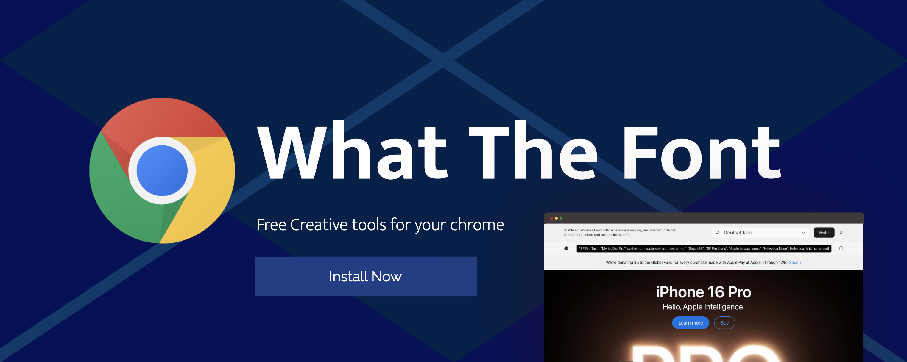

# What the Font

**What the Font** is a lightweight and user-friendly Chrome extension designed to help web developers, designers, and typography enthusiasts quickly identify the font-family of any element on a webpage. With a simple toggle, you can activate the extension and hover over any element to instantly view its font details. 

---

## ✨ Features
- 📋 **Font Identification**: Easily discover the `font-family` of any element by hovering over it.
- 🎨 **Minimalistic Design**: Clean and intuitive interface to enhance usability.
- 🚀 **Lightweight & Fast**: Efficiently runs without affecting browser performance.
- 🔄 **Toggle Activation**: Activate or deactivate the extension with a single click on its icon.
- ⚡ **Dynamic Injection**: Works seamlessly without requiring a page reload.

---

## 📦 Installation

1. Download or clone this repository to your local machine.
2. Open **Google Chrome** and navigate to `chrome://extensions/`.
3. Enable **Developer Mode** in the top-right corner.
4. Click on **Load unpacked** and select the folder containing the extension files.
5. The **What the Font** icon will appear in your browser toolbar.

---

## 🛠️ Usage

1. Click on the extension icon to activate it. The icon will change color to indicate activation.
2. Hover over any element on a webpage to view the font-family details.
3. Click the icon again to deactivate the extension.

---

## 🔐 Permissions

This extension only requires permission to access the active tab to inject its script and display font details.

---

## 🤝 Contributions

We welcome contributions! Feel free to:
- Submit issues for bugs or feature requests.
- Fork the repository and create pull requests for improvements.

---

## 📜 License

This project is licensed under the [MIT License](LICENSE).

---

### 💡 Inspiration

Typography is a key element in design, and identifying fonts used on websites is a common task for designers and developers. **What the Font** aims to simplify this process and save time for professionals and enthusiasts alike.

---

Enjoy the simplicity of font discovery with **What the Font**!
